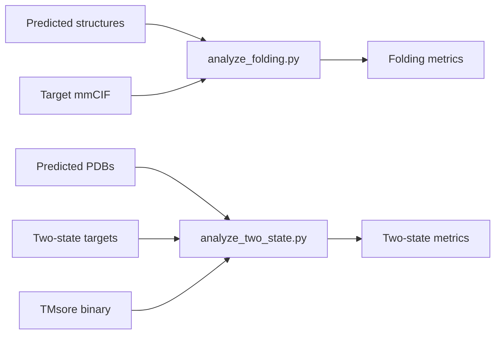

# Evaluation

Use OpenStructure 2.9.1 docker for folding tasks, and compiled TM-score for two-state tasks.

### Code citations

- Folding evaluation: [src/simplefold/evaluation/analyze_folding.py](../src/simplefold/evaluation/analyze_folding.py)
- Two-state evaluation: [src/simplefold/evaluation/analyze_two_state.py](../src/simplefold/evaluation/analyze_two_state.py)

