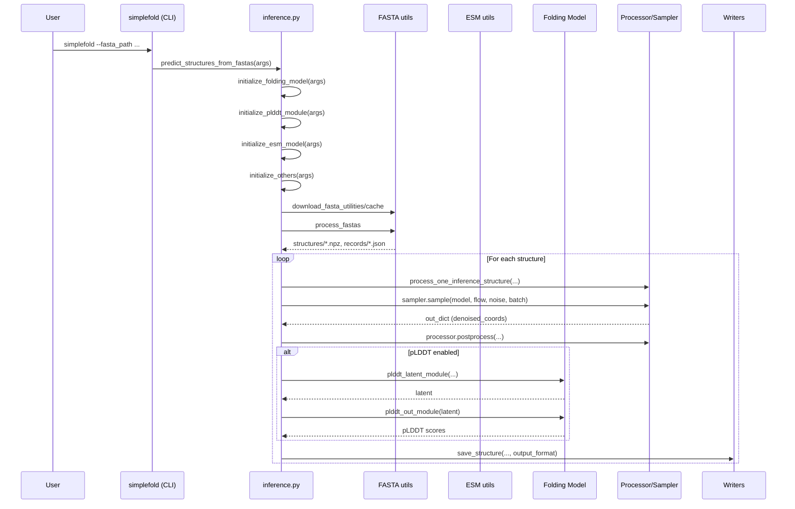

# Inference flow

Core functions live in `src/simplefold/inference.py` and entrypoint is `src/simplefold/cli.py`.



Clickable nodes:

```mermaid
%% Mermaid click bindings
click CLI "../src/simplefold/cli.py" "CLI entrypoint" _blank
click INF "../src/simplefold/inference.py" "Inference core" _blank
click FS "../src/simplefold/utils/fasta_utils.py" "FASTA helpers" _blank
click ESM "../src/simplefold/utils/esm_utils.py" "ESM utils" _blank
click P "../src/simplefold/processor/protein_processor.py" "Processor & sampling glue" _blank
click W "../src/simplefold/utils/boltz_utils.py" "Writers (PDB/mmCIF)" _blank
```

### Code citations

- initialize_folding_model/initialize_plddt_module/initialize_esm_model/initialize_others: [src/simplefold/inference.py](../src/simplefold/inference.py)
- process_one_inference_structure: [src/simplefold/utils/datamodule_utils.py](../src/simplefold/utils/datamodule_utils.py)
- ProteinDataProcessor.preprocess_inference/postprocess: [src/simplefold/processor/protein_processor.py](../src/simplefold/processor/protein_processor.py)
- EMSampler (Torch/MLX): [src/simplefold/model/torch/sampler.py](../src/simplefold/model/torch/sampler.py), [src/simplefold/model/mlx/sampler.py](../src/simplefold/model/mlx/sampler.py)
- Flow path (LinearPath): [src/simplefold/model/flow.py](../src/simplefold/model/flow.py)
- Writers (process_structure/save_structure): [src/simplefold/utils/boltz_utils.py](../src/simplefold/utils/boltz_utils.py)

Key modules:

- Tokenization/featurization: `BoltzTokenizer`, `BoltzFeaturizer`
- Flow path: `LinearPath`
- Sampler: `EMSampler` (Torch) or `EMSampler` (MLX)
- ESM: `esm_registry["esm2_3B"]()`, mapped to MLX backend when needed


