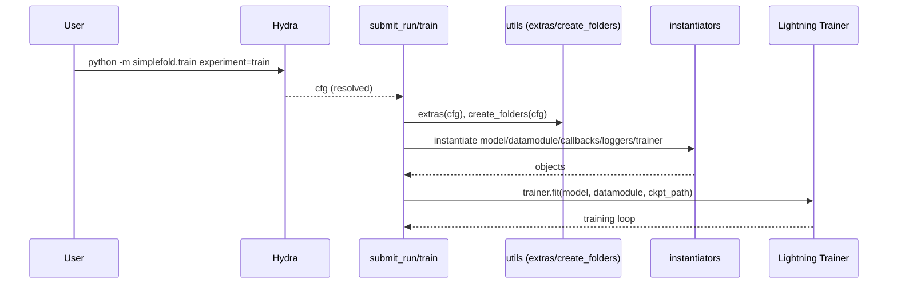

# Training pipeline

Entrypoint: `src/simplefold/train.py` with Hydra configs under `configs/`.



Notes:

- Precision/TF32 settings are configured at import time in `train.py`.
- When `load_ckpt_path` is provided, ESM is reset and certain schedules toggled for finetuning.

```mermaid
%% Mermaid click bindings
click TR "../src/simplefold/train.py" "submit_run/train" _blank
click UT "../src/simplefold/utils/utils.py" "extras/create_folders" _blank
click INST "../src/simplefold/utils/instantiators.py" "instantiate_*" _blank
click HY "../configs" "Hydra configs" _blank
```

### Code citations

- submit_run/train: [src/simplefold/train.py](../src/simplefold/train.py)
- instantiate_trainer/instantiate_callbacks/instantiate_loggers: [src/simplefold/utils/instantiators.py](../src/simplefold/utils/instantiators.py)
- extras/create_folders: [src/simplefold/utils/utils.py](../src/simplefold/utils/utils.py)
- Hydra configs root: [configs/](../configs/)


